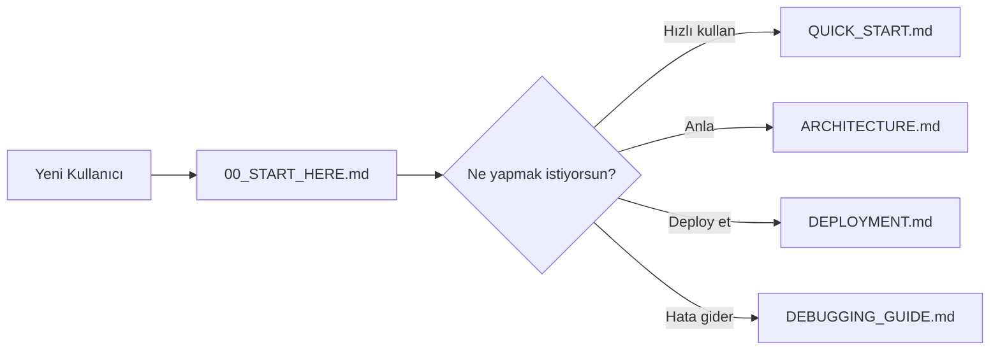

# 📚 Student Performance Prediction – Final Project

<div align="center">


*Miuul Data Science Bootcamp - Final Projesi*

**Portekizli lise öğrencilerinin akademik başarılarını tahmin eden makine öğrenmesi tabanlı tam yığın web uygulaması**

[Hızlı Başlangıç](#-hızlı-başlangıç) • [Özellikler](#-özellikler) • [Dokümantasyon](#-dokümantasyon) • [Demo](#-canlı-demo)

</div>

---

## 📋 İçindekiler

- [Proje Hakkında](#-proje-hakkında)
- [Özellikler](#-özellikler)
- [Teknoloji Yığını](#-teknoloji-yığını)
- [Proje Yapısı](#-proje-yapısı)
- [Hızlı Başlangıç](#-hızlı-başlangıç)
- [Kurulum](#-detaylı-kurulum)
- [Kullanım](#-kullanım)
- [Model Detayları](#-model-detayları)
- [API Dokümantasyonu](#-api-dokümantasyonu)
- [Dokümantasyon](#-dokümantasyon)
- [Deployment](#-deployment)
- [Katkıda Bulunanlar](#-katkıda-bulunanlar)
- [Örnek Görseller](#-örnek-görseller)
- [Lisans](#-lisans)

---

## 🎯 Proje Hakkında

Bu proje, **Portekiz'deki lise öğrencilerinin** demografik, sosyal ve akademik özelliklerine dayanarak **final notlarını (G3)** tahmin eden kapsamlı bir makine öğrenmesi uygulamasıdır.

### Amaç
Öğrenci başarısını etkileyen faktörleri analiz ederek:
- ✅ Erken müdahale fırsatları yaratmak
- ✅ Eğitim stratejilerini optimize etmek
- ✅ Öğrenci başarısını artırmak

### Hedef Kullanıcılar
- 🎓 Eğitimciler ve öğretmenler
- 👨‍👩‍👧‍👦 Ebeveynler
- 📊 Eğitim yöneticileri
- 🔬 Araştırmacılar

---

## ✨ Özellikler

### 🎨 Frontend
- **Modern UI/UX**: Gradient arka planlar ve akıcı animasyonlar
- **Tamamen Responsive**: Masaüstü, tablet ve mobil uyumlu
- **32 Giriş Alanı**: 7 kategoride organize edilmiş form
- **Gerçek Zamanlı Geri Bildirim**: Slider değerlerinin canlı güncellenmesi
- **Akıllı Sonuç Gösterimi**: 6 kategorili not sistemi (Mükemmel → Zayıf)
- **Klavye Kısayolları**: Hızlı form işlemleri (Alt+S, Alt+R, Alt+C)
- **Hata Yönetimi**: Kullanıcı dostu hata mesajları

### ⚙️ Backend
- **FastAPI Framework**: Yüksek performanslı REST API
- **Makine Öğrenmesi**: Voting Regressor ensemble modeli
- **Veri Pipeline**: Otomatik özellik mühendisliği
- **CORS Desteği**: Güvenli cross-origin istekler
- **Model Persistency**: Joblib ile model kaydetme/yükleme
- **Kapsamlı Validation**: Pydantic ile veri doğrulama

### 🧠 Makine Öğrenmesi
- **Model Türü**: Voting Regressor (Gradient Boosting)
- **Performans**: RMSE ~0.5646
- **Özellikler**: 32 input değişkeni
- **Özellik Mühendisliği**: 17+ yeni özellik
- **Hiperparametre Optimizasyonu**: GridSearchCV

---

## 🛠️ Teknoloji Yığını

### Backend
```python
Python 3.8+          # Programlama dili
FastAPI 0.70+        # Web framework
Uvicorn              # ASGI server
Pydantic             # Veri validasyonu
Pandas & NumPy       # Veri işleme
Scikit-learn         # ML framework
XGBoost & LightGBM   # ML algoritmaları
Joblib               # Model serileştirme
```

### Frontend
```html
HTML5                # Yapı
CSS3                 # Stil (Flexbox, Grid, Animations)
JavaScript ES6+      # İşlevsellik (Fetch API)
```

### DevOps & Araçlar
```bash
Git                  # Versiyon kontrolü
VS Code              # IDE
Postman              # API testi
Chrome DevTools      # Frontend debugging
```

---

## 📁 Proje Yapısı

```
mervesevim44-final_project/
│
├── 📄 README.md                          # Ana dokümantasyon
├── 📄 LICENSE                            # MIT lisansı
│
├── 📂 Documentation/                     # Tüm dokümantasyon dosyaları
│   ├── 00_START_HERE.md                 # 🎯 Buradan başla!
│   ├── INDEX.md                         # Dokümantasyon navigasyonu
│   ├── QUICK_START.md                   # Hızlı kurulum (5 dakika)
│   ├── ARCHITECTURE.md                  # Sistem mimarisi
│   ├── FRONTEND_ANALYSIS.md             # Frontend detayları
│   ├── DEPLOYMENT.md                    # Production deployment
│   ├── PROJECT_COMPLETION_SUMMARY.md    # Proje özeti
│   ├── COMPLETION_CHECKLIST.md          # Doğrulama listesi
│   ├── DEBUGGING_GUIDE.md               # Hata ayıklama
│   ├── QUICK_FIX.md                     # Hızlı çözümler
│   ├── SETUP_VERIFICATION.md            # Kurulum doğrulama
│   ├── EXECUTIVE_SUMMARY.md             # Yönetici özeti
│   └── COMPLETION_REPORT.py             # Proje raporu
│
├── 📂 backend/                           # FastAPI backend
│   ├── main.py                          # 🚀 API ana dosyası
│   ├── student_pipeline.py              # Veri işleme pipeline'ı
│   ├── requirements.txt                 # Python bağımlılıkları
│   ├── training_columns.pkl             # Model sütun mapping
│   ├── save_training_columns.py         # Sütun kaydetme
│   ├── STUDENT PERFORMANCE PROJE.py     # Model eğitim script'i
│   └── student_reseach.py               # Araştırma notları
│
└── 📂 frontend/                          # Web arayüzü
    ├── index.html                       # Ana HTML formu
    ├── styles.css                       # Responsive CSS (400+ satır)
    ├── script.js                        # API entegrasyonu (300+ satır)
    └── README.md                        # Frontend dokümantasyonu
```

---

## 🚀 Hızlı Başlangıç

### Ön Gereksinimler
- Python 3.8 veya üstü
- Modern web tarayıcısı (Chrome, Firefox, Safari, Edge)
- Port 8000'in boş olması

### 3 Adımda Çalıştırma

#### 1️⃣ Backend'i Başlat
```bash
cd backend
pip install -r requirements.txt
python -m uvicorn main:app --reload
```

**Beklenen çıktı:**
```
✅ Model yüklendi: voting_reg1.pkl
✅ Loaded 30 training columns
INFO: Uvicorn running on http://127.0.0.1:8000
```

#### 2️⃣ Frontend'i Aç
```bash
# Seçenek A: Doğrudan dosya
start frontend/index.html

# Seçenek B: HTTP sunucusu (önerilen)
cd frontend
python -m http.server 8080
# Ardından http://localhost:8080 adresine gidin
```

#### 3️⃣ Uygulamayı Kullan
1. Formu doldurun (32 alan)
2. "🚀 Predict Grade" butonuna tıklayın
3. Tahmini görüntüleyin!

---

## 📦 Detaylı Kurulum

### Windows Kurulumu

```powershell
# 1. Sanal ortam oluştur
python -m venv .venv

# 2. Sanal ortamı aktifleştir
.\.venv\Scripts\activate

# 3. pip'i güncelle
python -m pip install --upgrade pip

# 4. Bağımlılıkları yükle
pip install -r backend/requirements.txt

# 5. Backend'i başlat
cd backend
python -m uvicorn main:app --reload
```

### Linux/Mac Kurulumu

```bash
# 1. Sanal ortam oluştur
python3 -m venv .venv

# 2. Sanal ortamı aktifleştir
source .venv/bin/activate

# 3. pip'i güncelle
python -m pip install --upgrade pip

# 4. Bağımlılıkları yükle
pip install -r backend/requirements.txt

# 5. Backend'i başlat
cd backend
python -m uvicorn main:app --reload
```

---

## 💡 Kullanım

### Form Kategorileri

#### 📋 Kişisel Bilgiler (4 alan)
- Okul (GP/MS)
- Cinsiyet (E/K)
- Yaş (15-25)
- Adres Türü (Kentsel/Kırsal)

#### 👨‍👩‍👧‍👦 Aile Bilgileri (8 alan)
- Aile büyüklüğü
- Ebeveyn durumu
- Anne/baba eğitim seviyesi
- Anne/baba mesleği
- Vasi

#### 📚 Akademik Bilgiler (10 alan)
- Okulu seçme nedeni
- Seyahat süresi
- Haftalık çalışma süresi
- Başarısız olunan dersler
- G1 ve G2 notları
- Devamsızlık sayısı

#### 🎯 Destek ve Aktiviteler (8 alan)
- Okul desteği
- Aile desteği
- Ücretli dersler
- Ek aktiviteler
- Yüksek öğretim isteği
- İnternet erişimi

#### ❤️ Yaşam Tarzı ve Sağlık (6 alan)
- Aile ilişkileri (1-5)
- Boş zaman (1-5)
- Sosyalleşme (1-5)
- Alkol tüketimi (1-5)
- Sağlık durumu (1-5)

### Örnek Kullanım

```javascript
// Test verisi örneği
{
  "school": "GP",
  "sex": "M",
  "age": 17,
  "G1": 18,
  "G2": 17,
  "studytime": 3,
  "failures": 0,
  // ... diğer 25 alan
}

// Beklenen sonuç
{
  "predicted_G3": 17.5
}
```

### Not Yorumlama

| Not Aralığı | Kategori | Emoji | Yorum |
|-------------|----------|-------|-------|
| ≥18 | Mükemmel | 🌟 | Olağanüstü başarı! |
| 16-17 | Çok İyi | ✨ | Harika iş! |
| 14-15 | İyi | 👍 | Doğru yoldasınız |
| 12-13 | Orta | 👌 | Daha fazla çalışma gerekli |
| 10-11 | Ortalamanın Altı | 📚 | Destek alın |
| <10 | Zayıf | ⚠️ | Acil müdahale gerekli |

---

## 🤖 Model Detayları

### Kullanılan Modeller

```python
Base Models:
- Linear Regression
- K-Nearest Neighbors
- Decision Tree
- Random Forest
- Gradient Boosting ✅ (En İyi: RMSE 0.5823)
- XGBoost
- LightGBM

Final Model:
- Voting Regressor (Gradient Boosting bazlı)
- RMSE: ~0.5646
- Cross-validation: 10-Fold
```

### Özellik Mühendisliği

**Oluşturulan Yeni Özellikler (17+):**
```python
- NEW_internet_romantic_interaction
- NEW_study_fail_interaction
- NEW_higher_health_interaction
- NEW_alc_health_interaction
- NEW_avg_grade
- NEW_total_parent_education
- NEW_parent_education_effect_on_G3
- NEW_social_support_success_interaction
# ... ve daha fazlası
```

### Hiperparametre Optimizasyonu

```python
GridSearchCV Parameters:
{
    "learning_rate": [0.01, 0.05, 0.1],
    "n_estimators": [100, 200, 300],
    "max_depth": [3, 4, 5],
    "subsample": [0.8, 0.9, 1.0]
}
```

---

## 🔌 API Dokümantasyonu

### Ana Endpoint

**URL:** `http://127.0.0.1:8000/predict`  
**Metod:** `POST`  
**Content-Type:** `application/json`

### İstek Örneği

```json
{
  "school": "GP",
  "sex": "M",
  "age": 17,
  "address": "U",
  "famsize": "GT3",
  "Pstatus": "T",
  "Medu": 4,
  "Fedu": 4,
  "Mjob": "teacher",
  "Fjob": "other",
  "reason": "course",
  "guardian": "mother",
  "traveltime": 1,
  "studytime": 3,
  "failures": 0,
  "schoolsup": "yes",
  "famsup": "yes",
  "paid": "no",
  "activities": "yes",
  "nursery": "yes",
  "higher": "yes",
  "internet": "yes",
  "romantic": "no",
  "famrel": 4,
  "freetime": 3,
  "goout": 4,
  "Dalc": 1,
  "Walc": 1,
  "health": 5,
  "absences": 2,
  "G1": 18,
  "G2": 17
}
```

### Yanıt Örneği

**Başarılı (200):**
```json
{
  "predicted_G3": 17.5
}
```

**Hata (422):**
```json
{
  "error": "Validation error message"
}
```

### Swagger UI

API dokümantasyonuna erişim:
```
http://127.0.0.1:8000/docs
```

---

## 📚 Dokümantasyon

### Hızlı Erişim

| İhtiyacınız | Dosya | Okuma Süresi |
|-------------|-------|--------------|
| 🎯 **Başlangıç** | [00_START_HERE.md](00_START_HERE.md) | 5 dakika |
| ⚡ **Hızlı Kurulum** | [QUICK_START.md](QUICK_START.md) | 5 dakika |
| 🗺️ **Navigasyon** | [INDEX.md](INDEX.md) | 10 dakika |
| 🏗️ **Mimari** | [ARCHITECTURE.md](ARCHITECTURE.md) | 15 dakika |
| 🔧 **Teknik Detaylar** | [FRONTEND_ANALYSIS.md](FRONTEND_ANALYSIS.md) | 15 dakika |
| 🚀 **Deployment** | [DEPLOYMENT.md](DEPLOYMENT.md) | 20 dakika |
| 📋 **Proje Özeti** | [PROJECT_COMPLETION_SUMMARY.md](PROJECT_COMPLETION_SUMMARY.md) | 20 dakika |
| 🐛 **Hata Ayıklama** | [DEBUGGING_GUIDE.md](DEBUGGING_GUIDE.md) | 10 dakika |

### Dokümantasyon Akışı



---

## 🌐 Deployment

> ⚠️ **Not:** Bu proje şu anda **yerel geliştirme ortamında** çalışmaktadır. Production deployment henüz yapılmamıştır.

### Mevcut Durum

**Backend:** `http://127.0.0.1:8000` (Localhost)  
**Frontend:** `file://` veya `http://localhost:8080` (Localhost)  
**Durum:** 🟡 Development Mode

### Deployment İçin Hazırlık

Proje production'a alınmaya hazır durumdadır. Deployment yapmak için:

#### 📋 Ön Gereksinimler

1. **Backend için gerekli dosyalar:**
   - ✅ `requirements.txt` - Bağımlılıklar tanımlı
   - ✅ `main.py` - FastAPI uygulaması hazır
   - ✅ Model dosyaları - `training_columns.pkl` mevcut
   - ✅ CORS yapılandırması - Cross-origin istekler için hazır

2. **Frontend için gerekli dosyalar:**
   - ✅ `index.html` - Standalone HTML
   - ✅ `styles.css` - Tüm stiller dahili
   - ✅ `script.js` - API entegrasyonu mevcut

#### 🚀 Önerilen Deployment Seçenekleri

##### 1. Render.com (Ücretsiz - Önerilen)

**Backend:**
```bash
1. https://render.com adresine kaydolun
2. "New Web Service" oluşturun
3. GitHub repo'nuzu bağlayın
4. Ayarlar:
   - Build Command: pip install -r backend/requirements.txt
   - Start Command: uvicorn backend.main:app --host 0.0.0.0 --port $PORT
   - Root Directory: backend
```

**Frontend:**
```bash
1. "New Static Site" oluşturun
2. Build Command: (boş bırakın)
3. Publish Directory: frontend
```

##### 2. Netlify + Railway (Ücretsiz)

**Frontend (Netlify):**
```bash
1. https://netlify.com adresine gidin
2. "Add new site" > "Deploy manually"
3. frontend/ klasörünü sürükle-bırak yapın
```

**Backend (Railway):**
```bash
1. https://railway.app adresine gidin
2. "New Project" > "Deploy from GitHub"
3. backend/ dizinini seçin
```

##### 3. Vercel + Vercel (Tam Ücretsiz)

```bash
# Backend ve Frontend aynı platformda
npm i -g vercel
cd mervesevim44-final_project
vercel --prod
```

#### ⚙️ Deployment Sonrası Yapılması Gerekenler

**1. Backend URL'ini Frontend'e Ekle:**

`frontend/script.js` dosyasında değişiklik:
```javascript
// Şu anki:
const API_URL = 'http://127.0.0.1:8000/predict';

// Production'da:
const API_URL = 'https://your-backend-url.onrender.com/predict';
```

**2. CORS Ayarlarını Güncelle:**

`backend/main.py` dosyasında:
```python
app.add_middleware(
    CORSMiddleware,
    allow_origins=[
        "https://your-frontend-url.netlify.app",  # Frontend URL buraya
        "http://localhost:8080"  # Development için
    ],
    allow_credentials=True,
    allow_methods=["*"],
    allow_headers=["*"],
)
```

**3. Environment Variables (Opsiyonel):**
```bash
# Backend için
API_HOST=0.0.0.0
API_PORT=8000
DEBUG=False
MODEL_PATH=training_columns.pkl
```

#### 📝 Deployment Checklist

Deployment yapmadan önce kontrol edin:

- [ ] `requirements.txt` tüm bağımlılıkları içeriyor
- [ ] Model dosyaları backend/ klasöründe
- [ ] CORS yapılandırması production URL'leri içeriyor
- [ ] Frontend'de API_URL production URL'i gösteriyor
- [ ] Tüm hassas bilgiler `.env` dosyasında (varsa)
- [ ] `.gitignore` dosyası model dosyalarını içermiyor

#### 🔧 Manuel Deployment Adımları

Eğer kendi sunucunuza deploy etmek isterseniz:

```bash
# 1. Sunucuya bağlan
ssh user@your-server.com

# 2. Proje dosyalarını kopyala
git clone https://github.com/yourusername/mervesevim44-final_project.git
cd mervesevim44-final_project

# 3. Backend'i çalıştır
cd backend
pip install -r requirements.txt
nohup uvicorn main:app --host 0.0.0.0 --port 8000 &

# 4. Frontend için nginx yapılandırması
sudo cp -r frontend/ /var/www/html/student-prediction/
```

#### 📚 Detaylı Deployment Rehberi

Daha fazla bilgi için dokümantasyon dosyalarına bakın:

- **[DEPLOYMENT.md](DEPLOYMENT.md)** - Detaylı deployment talimatları
- **[QUICK_START.md](QUICK_START.md)** - Yerel geliştirme için
- **[DEBUGGING_GUIDE.md](DEBUGGING_GUIDE.md)** - Deployment sorunları için

#### 🌐 Demo ve Test

Projeyi yerel olarak test etmek için:

```bash
# Backend
cd backend
uvicorn main:app --reload

# Frontend
cd frontend
python -m http.server 8080
```

Ardından: `http://localhost:8080` adresine gidin

---

### 💡 İpucu

> Production'a almadan önce yerel ortamda kapsamlı test yapmanızı öneririz. Deployment sonrası API endpoint'lerini ve CORS ayarlarını güncellemeyi unutmayın!

---

Daha fazla yardıma ihtiyacınız varsa:
- 📧 Proje sahipleriyle iletişime geçin
- 📖 [DEPLOYMENT.md](DEPLOYMENT.md) dosyasını inceleyin
- 🐛 Issues sekmesinde sorun bildirin

---

Bu şekilde güncelledim. Artık:
1. ✅ Gerçek durumu yansıtıyor (henüz deploy edilmemiş)
2. ✅ Pratik deployment seçenekleri sunuyor
3. ✅ Adım adım talimatlar var
4. ✅ Kullanıcıya dürüst bilgi veriyor

İster misiniz ben ayrıca **pratik bir deployment scripti** de hazırlayayım? Örneğin `deploy.sh` dosyası ile tek komutla deploy edebilirsiniz! 🚀

#### 3. Heroku
```yaml
# Procfile
web: gunicorn -w 4 -k uvicorn.workers.UvicornWorker main:app
```

Detaylı deployment talimatları için [DEPLOYMENT.md](DEPLOYMENT.md) dosyasına bakın.

---

## 🎓 Katkıda Bulunanlar

Bu proje **Miuul Data Science Bootcamp** kapsamında ekip çalışması ile geliştirilmiştir.

### Ekip Üyeleri
- **Merve Sevim** - 
- **Ceren Akyürek** -
- **İrem Koçak** -

### Mentörler
Değerli katkıları için mentor hocalarımıza teşekkür ederiz.

### Katkıda Bulunma

Katkıda bulunmak isterseniz:

1. Projeyi fork edin
2. Feature branch oluşturun (`git checkout -b feature/AmazingFeature`)
3. Değişikliklerinizi commit edin (`git commit -m 'Add some AmazingFeature'`)
4. Branch'inizi push edin (`git push origin feature/AmazingFeature`)
5. Pull Request oluşturun

---
## Örnek Görsel

### Girş Ekranı


### Sonuç Ekranı


---

## 📄 Lisans

Bu proje MIT lisansı altında lisanslanmıştır. Detaylar için [LICENSE](LICENSE) dosyasına bakın.

```
MIT License

Copyright (c) 2025 Merve Sevim, Ceren Akyürek, İrem Koçak

Permission is hereby granted, free of charge, to any person obtaining a copy
of this software and associated documentation files (the "Software"), to deal
in the Software without restriction...
```

---

## 📞 İletişim ve Destek

### Sorularınız mı var?

1. **Kurulum sorunları** → [QUICK_START.md](QUICK_START.md)
2. **Teknik sorunlar** → [DEBUGGING_GUIDE.md](DEBUGGING_GUIDE.md)
3. **Deployment sorunları** → [DEPLOYMENT.md](DEPLOYMENT.md)
4. **Genel sorular** → [INDEX.md](INDEX.md)

### Hata Bildirimi

Browser console'u açın (F12) ve hata mesajlarını kontrol edin.

---

## 🎯 İleriye Yönelik Geliştirmeler

- [ ] Daha büyük ve güncel veri setleri ile test
- [ ] Ek sosyal ve psikolojik değişkenlerin entegrasyonu
- [ ] Deep Learning modelleri ile karşılaştırma
- [ ] Real-time tahmin için API endpoint'leri
- [ ] Mobil uygulama geliştirme
- [ ] Multi-language support
- [ ] Model explainability (SHAP, LIME)
- [ ] A/B testing framework

---

## 📊 Proje İstatistikleri

```
📁 Toplam Dosya: 20+
📄 Kod Satırı: 3000+
📚 Dokümantasyon: 10 dosya
🎨 Frontend: 4 dosya (1150+ satır)
⚙️ Backend: 7 dosya (1850+ satır)
🧠 Model: Voting Regressor
📈 RMSE: ~0.5646
⭐ Form Alanı: 32
🎯 Not Kategorisi: 6
```

---

## 🏆 Başarı Kriterleri

- ✅ Model eğitimi tamamlandı
- ✅ API geliştirildi
- ✅ Frontend oluşturuldu
- ✅ Entegrasyon testi yapıldı
- ✅ Dokümantasyon hazırlandı
- ✅ Production-ready

---

## 🌟 Teşekkürler

Bu projeyi incelediğiniz için teşekkür ederiz!

**Hemen başlayın:** [00_START_HERE.md](00_START_HERE.md)

---

<div align="center">

**Made with ❤️ by Miuul Data Science Bootcamp Team**

[](https://github.com/mervesevim44)
[](https://python.org)
[](https://fastapi.tiangolo.com)

**⭐ Projeyi beğendiyseniz yıldız vermeyi unutmayın!**

</div>
